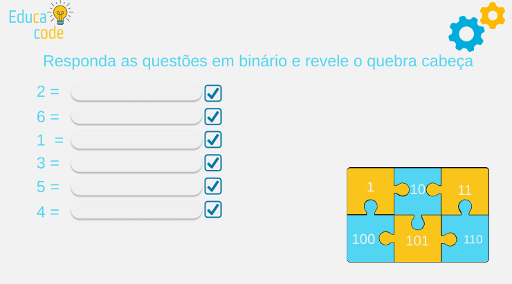

# Educacode

## Descrição 

&nbsp;&nbsp;&nbsp;&nbsp;O EducaCode é um jogo educativo desenvolvido com o objetivo de ensinar os princípios da computação de forma transversal, em conformidade com as diretrizes da BNCC Computação. As fases do jogo são planejadas para integrar conteúdos da disciplina com tópicos fundamentais da computação, promovendo uma aprendizagem contextualizada e significativa.

&nbsp;&nbsp;&nbsp;&nbsp;Nesse contexto, o EducaCode é desenvolvido como uma proposta alinhada às exigências das novas legislações que regulamentam o ensino de Computação na educação básica. Entre elas, destacam-se a Política Nacional de Educação Digital (PNED) — Lei nº 14.533 — e a Estratégia Nacional de Escolas Conectadas (ENEC) — Decreto nº 11.713/2023 —, além das diretrizes estabelecidas pela BNCC para Computação. Essas normativas tornam obrigatória a inserção da Computação no currículo escolar, e o EducaCode surge como uma solução pedagógica inovadora para apoiar escolas e educadores nesse processo de implementação. 

&nbsp;&nbsp;&nbsp;&nbsp;Atualmente, o jogo conta com duas fases finalizadas. A primeira, voltada para Matemática, aborda a conversão de números binários aliada ao reconhecimento de algarismos e símbolos. A segunda, direcionada para Geografia, explora conteúdos como os pontos cardeais, a rosa dos ventos e o mapa do Brasil, integrando esses temas ao conceito de instruções e algoritmos.

    

    

&nbsp;&nbsp;&nbsp;&nbsp;O jogo está em constante desenvolvimento e, em breve, contará com novas fases integrando outras disciplinas, ampliando ainda mais seu potencial interdisciplinar e sua contribuição para a formação de competências digitais.

## Habilidades

As habilidades contempladas na atividade de Matemática dizem respeito ao que o estudante será capaz de compreender ao final do jogo:

- BNCC COMPUTAÇÃO: (EF04C005) Codificar diferentes informações para representação em computador (binária, ASCII, atributos de pixel, como RGB etc.) 
- (EF05C010) Expressar-se critica e criativamente na compreensão das mudanças tecnológicas no mundo do trabalho e sobre a evolução da sociedade.

Às competências da BNCC Computação para os desafios de geografia, temos: 
- (EF04C001) Reconhecer objetos do mundo real e/ou digital que podem ser representados através de matrizes que estabelecem uma organização na qual cada componente está em uma posição definida por coordenadas, fazendo manipulações simples sobre estas representações. 

- (EF04C004) Entender que para guardar, manipular e transmitir dados deve-se codificá-los de alguma forma que seja compreendida pela máquina (formato digital).

## Professora orientadora

- <a href="http://lattes.cnpq.br/1617562138746096">Esteic Janaína Santos Batista</a>
- <a href="http://lattes.cnpq.br/6311632162541654">Amaury Antonio de Castro Junior</a>

## Integrantes

- <a href="http://lattes.cnpq.br/6399802520605870">Bianca Lurdes Azevedo de Araujo</a>
- <a href="http://lattes.cnpq.br/7660717819920652">Matheus Piltz Scariot</a>

## Acesso ao jogo

&nbsp;&nbsp;&nbsp;&nbsp;O jogo está disponível no github pages:
- <a href="https://mthpiltz.github.io/educacode/">Link Educacode</a>

